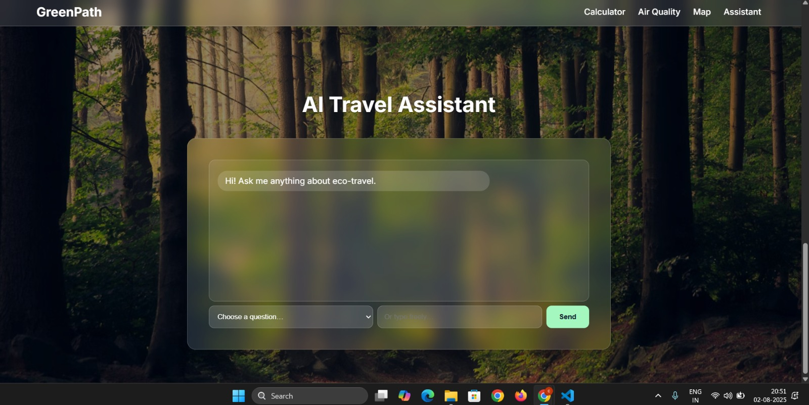
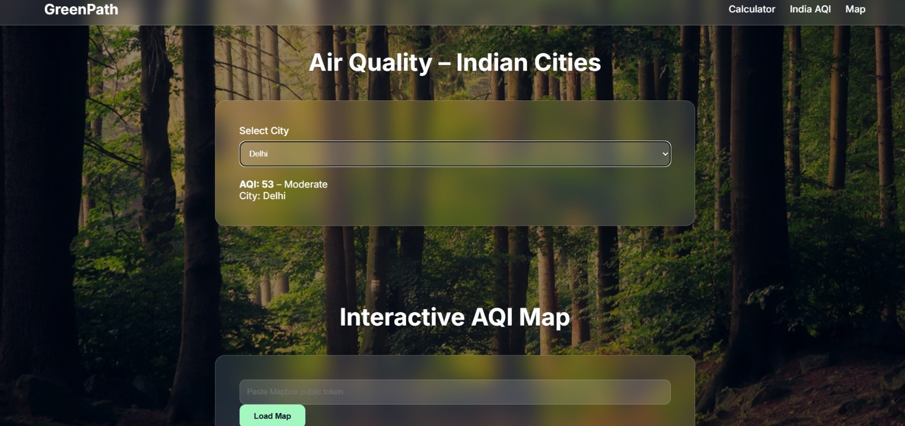
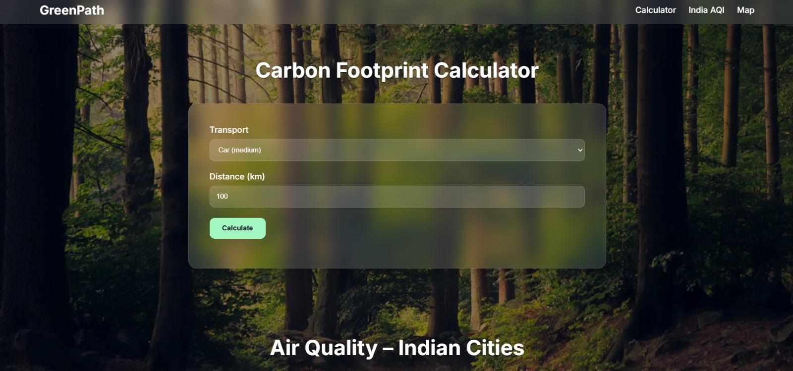
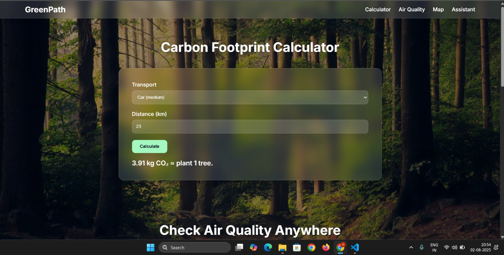

<h1 align="center">🌿 Eco Travel Mate</h1>
<p align="center">
  <b>AI-Powered Sustainable Travel Companion</b>  
  <br />
  <em>Smarter routes, lower emissions, better habits 💚</em>  
  <br /><br />
  <a href="https://alwinjosegeorge.github.io/Eco-Travel-Mate/"></a>
  <a href="https://alwinjosegeorge.github.io/Eco-Travel-Mate/"></a>
  <a href="#"></a>
</p>

---

## 🚀 Overview

**Eco Travel Mate** is a mobile app built to **track, motivate, and transform** how people commute — replacing carbon-heavy trips with eco-friendly options. Using AI, real-time GPS, and behavioral nudges, it empowers users to make greener choices and build sustainable travel habits.

> 🏆 Built in 48 hours for **Green Spark Hackathon 2025**

---

## 🧭 Table of Contents
- [🎯 Problem Statement](#-problem-statement)
- [🌱 Features](#-features)
- [🛠️ Tech Stack](#️-tech-stack)
- [📱 UI Screenshots](#-ui-screenshots)
- [📸 Extended Features](#-extended-features)
- [🧪 Getting Started](#-getting-started)
- [👥 Team](#-team)
- [📘 License](#-license)

---

## 🎯 Problem Statement

Short-distance car travel causes:
- 🌍 CO₂ Emissions  
- 🧍‍♂️ Lifestyle-related health issues

People often lack **awareness** and **real-time nudges** to switch to greener travel methods.

---

## 🌱 Features

| Feature                         | Description                                                                 |
|----------------------------------|-----------------------------------------------------------------------------|
| 🚶 **Travel Detection**          | Automatically detects walking, cycling, driving, and transit modes          |
| ♻️ **CO₂ Calculator**           | Real-time calculation of carbon footprint + health stats (e.g. kcal burned) |
| 🌿 **Eco Suggestions**          | Shows greener travel options with comparisons                               |
| 🎮 **GreenPoints & Challenges** | Earn points and complete weekly eco-challenges                              |
| 👨‍👩‍👧‍👦 **Family Leaderboards** | Compete and collaborate with groups and family                              |

---

## 🛠️ Tech Stack


---

## 📱 UI Screenshots

| Feature         | Description                      | Preview                                 |
|----------------|----------------------------------|------------------------------------------|
| 🏠 Home         | GreenScore, trip summary, tips   |              |
| 📊 Trip Log     | CO₂ impact of past trips         |                 |
| 💡 Suggestions  | Greener travel options           |               |
| 🏆 Leaderboard  | Eco competition with friends     |              |

---

## 📸 Extended Features

| Feature                     | Description                                           | Preview                                     |
|-----------------------------|-------------------------------------------------------|---------------------------------------------|
| 🤖 AI Travel Assistant       | Eco travel chatbot (FAQ, routes, queries)            |                |
| 💨 Air Quality Monitor       | Realtime AQI based on location                       |                 |
| 📊 Carbon Calculator (Input) | Manual footprint entry interface                     |                |
| 📈 Carbon Calculator (Result)| Graphical breakdown of emissions                     |               |

---

---

## 👥 Team Members

| Name                  | GitHub Profile                                      |
|-----------------------|-----------------------------------------------------|
| 🧠 Alwin Jose George  | [@alwinjosegeorge](https://github.com/alwinjosegeorge)  |
| 💻 Febin Nobel        | [@febin-04](https://github.com/febin-04)                |
| 🌐 Joe Martin Rince   | [@JoeMartinRince](https://github.com/JoeMartinRince)    |
| 🎯 Christwin S Jose   | [@Christwin-Soy-Jose](https://github.com/Christwin-Soy-Jose) |


---

## 🚧 Future Improvements

- 🌍 Geo-fenced carbon challenges
- 🔔 Notifications & reward system
- 📲 Progressive Web App (PWA) version
- 📉 Personalized carbon analytics dashboard

---

## 📜 License

This project is licensed under the [MIT License](LICENSE).

---

## 🌟 Give us a Star!

If you liked the project, show your support by ⭐ starring the repo!


## 🧪 Getting Started

```bash
# Clone the repo
git clone https://github.com/JoeMartinRince/Eco-.git
cd Eco-

# Install dependencies
flutter pub get

# Firebase setup
# → Add google-services.json (Android)
# → Add GoogleService-Info.plist (iOS)

# Run the app
flutter run
